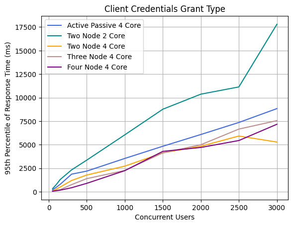
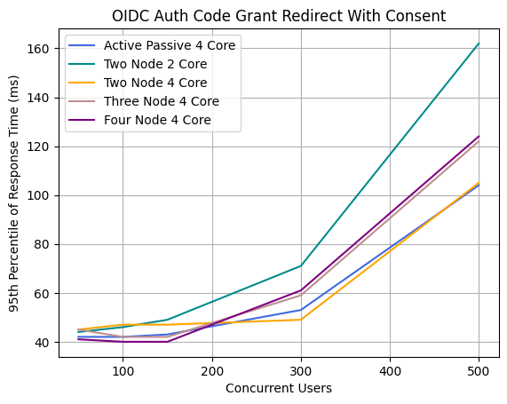
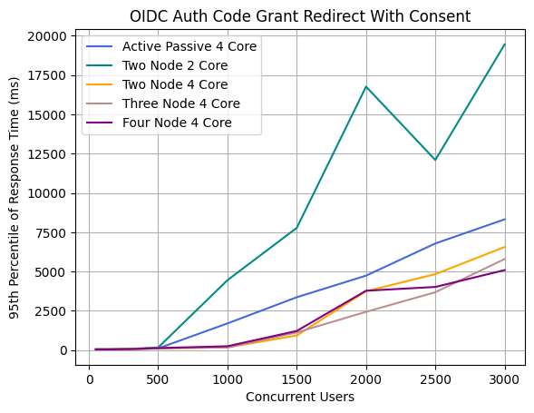
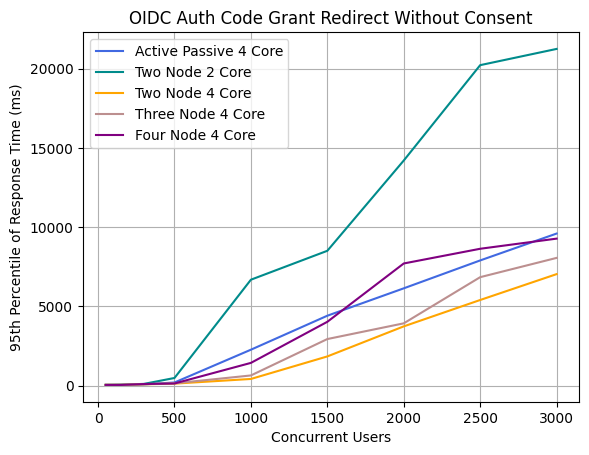
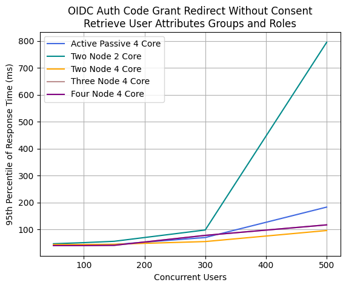
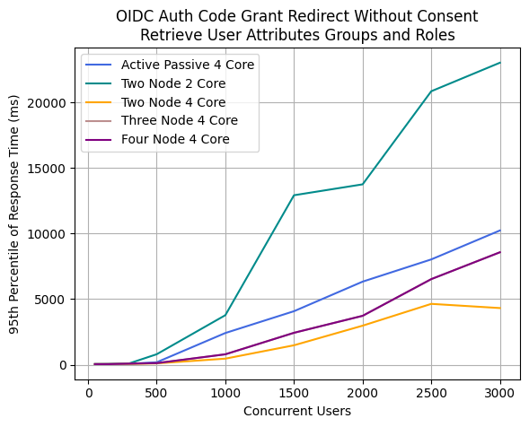
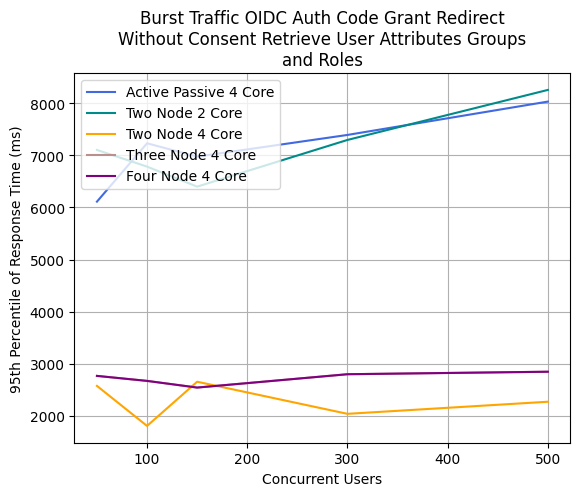
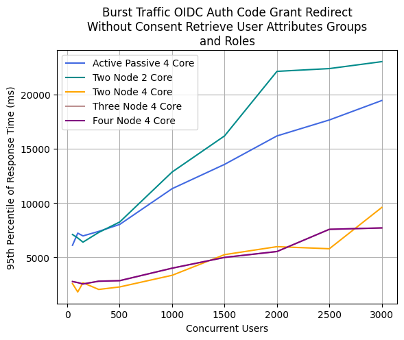
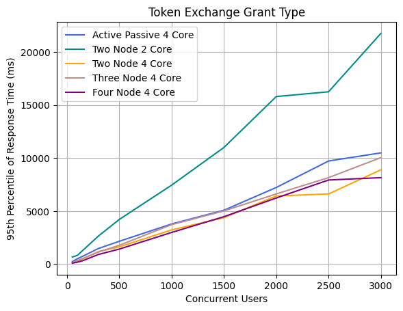
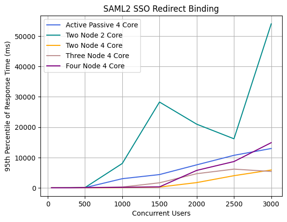

# IAM Performance Test Results Comparison

During each release, we execute various automated performance test scenarios and publish the results.

| Test Scenarios                                                                                           | Description                                                                                                                                                                                                                     |
|----------------------------------------------------------------------------------------------------------|---------------------------------------------------------------------------------------------------------------------------------------------------------------------------------------------------------------------------------|
| Client Credentials Grant Type                                                                            | Obtain an access token using the OAuth 2.0 client credential grant type.                                                                                                                                                        |
| OIDC Auth Code Grant Redirect With Consent                                                               | Obtain an access token and an id token using the OAuth 2.0 authorization code grant type.                                                                                                                                       |
| OIDC Auth Code Grant Redirect Without Consent                                                            | Obtain an access token and an id token using the OAuth 2.0 authorization code grant type without consent.                                                                                                                       |
| OIDC Auth Code Grant Redirect Without Consent Retrieving User Attributes, Groups and Roles               | Obtain an access token and an id token using the OAuth 2.0 authorization code grant type without consent. Retrieve country, email, first name and last name as user attributes. Additionally retrieve groups and roles as well. |
| Burst Traffic OIDC Auth Code Grant Redirect Without Consent Retrieving User Attributes, Groups and Roles | Obtain an access token and an id token using the OAuth 2.0 authorization code grant type without consent while 3000 burst one time traffic. Retrieve country, email, first name and last name as user attributes.               |
| Token Exchange Grant Type                                                                                | Obtain an access token and an id token using the token exchange grant type.                                                                                                                                                     |
| SAML2 SSO Redirect Binding                                                                               | Obtain a SAML 2 assertion response using redirect binding.                                                                                                                                                                      |

Our test client is [Apache JMeter](https://jmeter.apache.org/index.html). We test each scenario for a fixed duration of
time and split the test results into warm-up and measurement parts and use the measurement part to compute the
performance metrics. For this particular instance, the duration of each test is **15 minutes** and the warm-up period is **5 minutes**.

We run the performance tests under different numbers of concurrent users and heap sizes to gain a better understanding on how the server reacts to different loads.

The main performance metrics:

1. **Response Time**: The end-to-end latency for a given operation of the WSO2 Identity Server. The complete distribution of response times was recorded.

The following are the test specifications.

| Test Specification       | Description                                                 | Values                                                          |
|--------------------------|-------------------------------------------------------------|-----------------------------------------------------------------|
| No of Users              | The number of users created for the test cases              | 1000                                                            |
| No of OAuth Applications | The number of OAuth applications created for the test cases | 1000                                                            |
| No of SAML Applications  | The number of SAML applications created for the test cases  | 1000                                                            |
| Token Issuer             | Token issuer type                                           | JWT                                                             |

The following are the test parameters.

| Test Parameter                    | Description                                                                                                       | Values                                                          |
|-----------------------------------|-------------------------------------------------------------------------------------------------------------------|-----------------------------------------------------------------|
| Scenario Name                     | The name of the test scenario.                                                                                    | Refer to the above table.                                       |
| Heap Size                         | The amount of memory allocated to the application                                                                 | 2G                                                              |
| Concurrent Users                  | The number of users accessing the application at the same time.                                                   | 50, 100, 150, 300, 500, 1000, 1500, 2000, 2500, 3000            |
| IS Instance Type 2 Cores          | The AWS EC2 instance type used to run the Identity Server.                                                        | [**c5.large**](https://aws.amazon.com/ec2/instance-types/)      |
| IS Instance Type 4 Cores          | The AWS EC2 instance type used to run the Identity Server.                                                        | [**c5.xlarge**](https://aws.amazon.com/ec2/instance-types/)     |
| RDS Instance Type                 | The AWS RDS instance type used to run the Identity Server.                                                        | [**db.m4.2xlarge**](https://aws.amazon.com/rds/instance-types/) |
| RDS Instance max_connections      | The AWS RDS max_connections metric monitors the set maximum number of (allowed) simultaneous client connections.  | 2500                                                            |
| JDK version                       | The JDK version used to run the Identity Server.                                                                  | JDK 11.0.15.1                                                   |

Product Configurations: deployment.toml

```
[user_store.properties]
CaseInsensitiveUsername = false
SCIMEnabled=true
IsBulkImportSupported=false

[database.identity_db.pool_options]
maxActive = "400"

[database.shared_db.pool_options]
maxActive = "400"

[database.user.pool_options]
maxActive = "400"

[transport.https]
maxThreads = "400"
acceptCount = "400"
```

The following is the summary of performance test results collected for the measurement period.

### 1. Client Credentials Grant Type

#### Obtain an access token using the OAuth 2.0 client credential grant type.

Performance Comparison of Different Node Configurations with 95th Percentile of Response Time (ms)

| Concurrent Users | Active-Passive 4 Core | Two Node 2 Core | Two Node 4 Core | Three Node 4 Core | Four Node 4 Core |
|------------------|-----------------------|-----------------|-----------------|-------------------|------------------|
|   50   |   203  |   329  |   82   |   70   |   54   |
|  100   |   481  |   771  |   285  |   145  |   108  |
|  150   |   783  |  1295  |   495  |   220  |   163  |
|  300   |  1863  |  2319  |  1191  |   751  |   423  |
|  500   |  2191  |  3359  |  1775  |  1391  |   891  |
|  1000  |  3535  |  6047  |  2719  |  2255  |  2239  |
|  1500  |  4831  |  8767  |  4127  |  4127  |  4287  |
|  2000  |  6079  | 10367  |  4831  |  4991  |  4703  |
|  2500  |  7359  | 11135  |  5919  |  6655  |  5439  |
|  3000  |  8831  | 17791  |  5279  |  7551  |  7167  |

<ins> Concurrency: 50 - 500 </ins>


<ins> Concurrency: 50 - 3000 </ins>



### 2. OIDC Auth Code Grant Redirect With Consent

#### Obtain an access token and an id token using the OAuth 2.0 authorization code grant type.

Note: Response time is calculated only for the user credentials submission request.

Performance Comparison of Different Node Configurations with 95th Percentile of Response Time (ms)

| Concurrent Users | Active-Passive 4 Core | Two Node 2 Core | Two Node 4 Core | Three Node 4 Core | Four Node 4 Core |
|------------------|-----------------------|-----------------|-----------------|-------------------|------------------|
|   50   |   42   |   44   |   45   |   45   |   41   |
|  100   |   42   |   46   |   47   |   42   |   40   |
|  150   |   43   |   49   |   47   |   42   |   40   |
|  300   |   53   |   71   |   49   |   59   |   61   |
|  500   |  104   |  162   |  105   |  122   |  124   |
|  1000  | 1695   | 4447   |  166   |  162   |  241   |
|  1500  | 3359   | 7775   |  927   | 1119   | 1215   |
|  2000  | 4735   |16767   | 3743   | 2431   | 3775   |
|  2500  | 6783   |12095   | 4831   | 3679   | 4015   |
|  3000  | 8319   |19455   | 6559   | 5791   | 5087   |

<ins> Concurrency: 50 - 500 </ins>



<ins> Concurrency: 50 - 3000 </ins>



### 3. OIDC Auth Code Grant Redirect Without Consent

#### Obtain an access token and an id token using the OAuth 2.0 authorization code grant type.

Note: Response time is calculated only for the user credentials submission request.

Performance Comparison of Different Node Configurations with 95th Percentile of Response Time (ms)

| Concurrent Users | Active-Passive 4 Core | Two Node 2 Core | Two Node 4 Core | Three Node 4 Core | Four Node 4 Core |
|------------------|-----------------------|-----------------|-----------------|-------------------|------------------|
|  50  |  49  |  54  |  55  |  51  |  49  |
| 100  |  50  |  58  |  55  |  51  |  49  |
| 150  |  56  |  64  |  56  |  53  |  49  |
| 300  |  80  | 114  |  88  | 102  | 105  |
| 500  | 202  | 487  | 130  | 149  | 140  |
| 1000 | 2271 | 6687 |  425 |  647 | 1439 |
| 1500 | 4415 | 8511 | 1847 | 2943 | 4031 |
| 2000 | 6143 | 14207| 3743 | 3935 | 7711 |
| 2500 | 7903 | 20223| 5407 | 6847 | 8639 |
| 3000 | 9599 | 21247| 7039 | 8063 | 9279 |


<ins> Concurrency: 50 - 500 </ins>


<ins> Concurrency: 50 - 3000 </ins>




### 3.1. OIDC Auth Code Grant Redirect Without Consent Retrieve User Attributes, Groups and Roles

#### Obtain an access token and an id token using the OAuth 2.0 authorization code grant type. Retrieve country, email, first name and last name as user attributes.

Note: Response time is calculated only for the access token endpoint request.

Performance Comparison of Different Node Configurations with 95th Percentile of Response Time (ms)

| Concurrent Users | Active-Passive 4 Core | Two Node 2 Core | Two Node 4 Core | Three Node 4 Core | Four Node 4 Core |
|------------------|-----------------------|-----------------|-----------------|-------------------|------------------|
|   50  |   40  |   47  |   44  |   40  |   40  |
|  100  |   41  |   51  |   44  |   40  |   40  |
|  150  |   44  |   56  |   45  |   41  |   41  |
|  300  |   70  |   98  |   55  |   78  |   78  |
|  500  |  183  |  795  |   96  |  117  |  117  |
| 1000  | 2415  | 3775  |  459  |  791  |  791  |
| 1500  | 4079  |12927  | 1479  | 2431  | 2431  |
| 2000  | 6335  |13759  | 2975  | 3727  | 3727  |
| 2500  | 8031  |20863  | 4639  | 6527  | 6527  |
| 3000  |10239  |23039  | 4319  | 8575  | 8575  |


<ins> Concurrency: 50 - 500 </ins>



<ins> Concurrency: 50 - 3000 </ins>




### 3.1.1. Burst Traffic OIDC Auth Code Grant Redirect Without Consent Retrieve User Attributes, Groups and Roles

#### Obtain an access token and an id token using the OAuth 2.0 authorization code grant type. Retrieve country, email, first name and last name as user attributes. Further, the 6th minute of the test 3000 one time burst of concurrent requests are sent.

Note: Response time is calculated only for the access token endpoint request.

Performance Comparison of Different Node Configurations with 95th Percentile of Response Time (ms)

| Concurrent Users | Active-Passive 4 Core | Two Node 2 Core | Two Node 4 Core | Three Node 4 Core | Four Node 4 Core |
|------------------|-----------------------|-----------------|-----------------|-------------------|------------------|
|   50   |  6111  |  7103  |  2575  |  2767  |  2767  |
|  100   |  7231  |  6783  |  1807  |  2671  |  2671  |
|  150   |  6975  |  6399  |  2655  |  2543  |  2543  |
|  300   |  7391  |  7295  |  2039  |  2799  |  2799  |
|  500   |  8031  |  8255  |  2271  |  2847  |  2847  |
|  1000  | 11327  | 12863  |  3343  |  3999  |  3999  |
|  1500  | 13567  | 16191  |  5247  |  4991  |  4991  |
|  2000  | 16191  | 22143  |  5983  |  5535  |  5535  |
|  2500  | 17663  | 22399  |  5791  |  7583  |  7583  |
|  3000  | 19455  | 23039  |  9599  |  7711  |  7711  |


<ins> Concurrency: 50 - 500 </ins>



<ins> Concurrency: 50 - 3000 </ins>




### 4. OIDC Password Grant Type

#### Obtain an access token and an id token using the OAuth 2.0 password grant type.

Performance Comparison of Different Node Configurations with 95th Percentile of Response Time (ms)

| Concurrent Users | Active-Passive 4 Core | Two Node 2 Core | Two Node 4 Core | Three Node 4 Core | Four Node 4 Core |
|------------------|-----------------------|-----------------|-----------------|-------------------|------------------|
|   50   |   293  |   355  |   133  |   123  |   123  |
|  100   |   619  |   907  |   389  |   301  |   301  |
|  150   |   895  |  1551  |   655  |   459  |   459  |
|  300   |  1615  |  3135  |  1287  |   991  |   991  |
|  500   |  2511  |  5183  |  2143  |  1759  |  1759  |
|  1000  |  4511  | 10303  |  4223  |  5215  |  5215  |
|  1500  |  6527  | 12735  |  5951  |  9599  |  9599  |
|  2000  |  8447  | 17791  |  7615  | 13887  | 13887  |
|  2500  | 10303  | 22015  |  9023  | 10879  | 10879  |
|  3000  | 12799  | 28927  | 10815  | 18303  | 18303  |


<ins> Concurrency: 50 - 500 </ins>


<ins> Concurrency: 50 - 3000 </ins>


### 5. Token Exchange Grant Type

#### Obtain an access token and an id token using the token exchange grant type.

Performance Comparison of Different Node Configurations with 95th Percentile of Response Time (ms)

| Concurrent Users | Active-Passive 4 Core | Two Node 2 Core | Two Node 4 Core | Three Node 4 Core | Four Node 4 Core |
|------------------|-----------------------|-----------------|-----------------|-------------------|------------------|
|   50   |   58  |   60  |   63  |   59  |   59  |
|  100   |   59  |   60  |   64  |   56  |   59  |
|  150   |   61  |   64  |   61  |   57  |   59  |
|  300   |   67  |   80  |   66  |   58  |   59  |
|  500   |  110  |  141  |   76  |  125  |  128  |
|  1000  | 3055  | 8063  |  161  |  305  |  228  |
|  1500  | 4415  |28287  |  301  | 1703  |  363  |
|  2000  | 7615  |20991  | 1775  | 4703  | 5791  |
|  2500  |10751  |16191  | 4047  | 6207  | 8703  |
|  3000  |12991  |54015  | 5919  | 5439  |14911  |


<ins> Concurrency: 50 - 500 </ins>


<ins> Concurrency: 50 - 3000 </ins>




### 6. SAML2 SSO Redirect Binding

#### Obtain a SAML 2 assertion response using redirect binding.

Note: Response time is calculated only for the user credentials submission request.

Performance Comparison of Different Node Configurations with 95th Percentile of Response Time (ms)

| Concurrent Users | Active-Passive 4 Core | Two Node 2 Core | Two Node 4 Core | Three Node 4 Core | Four Node 4 Core |
|------------------|-----------------------|-----------------|-----------------|-------------------|------------------|
|   50   |   241  |   667  |   113  |   144  |    99  |
|  100   |   519  |   839  |   293  |   353  |   191  |
|  150   |   747  |  1295  |   485  |   539  |   327  |
|  300   |  1479  |  2655  |  1191  |  1143  |   915  |
|  500   |  2159  |  4223  |  1639  |  1783  |  1423  |
|  1000  |  3791  |  7455  |  3231  |  3727  |  2991  |
|  1500  |  5087  | 11007  |  4383  |  5023  |  4479  |
|  2000  |  7231  | 15807  |  6431  |  6623  |  6239  |
|  2500  |  9727  | 16255  |  6623  |  8159  |  7935  |
|  3000  | 10495  | 21759  |  8895  | 10047  |  8159  |


<ins> Concurrency: 50 - 500 </ins>


<ins> Concurrency: 50 - 3000 </ins>


